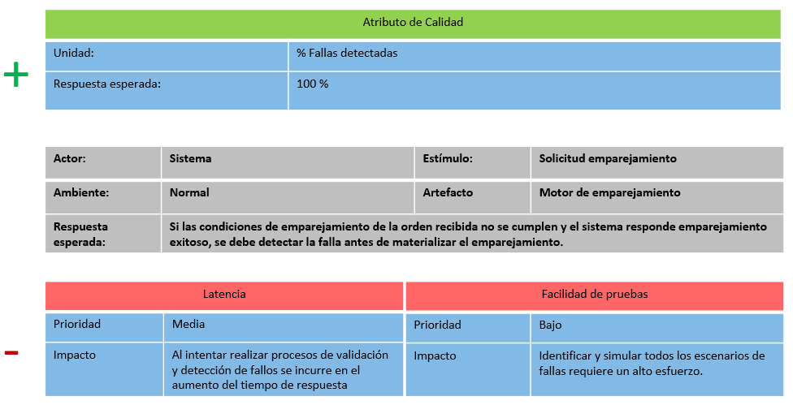
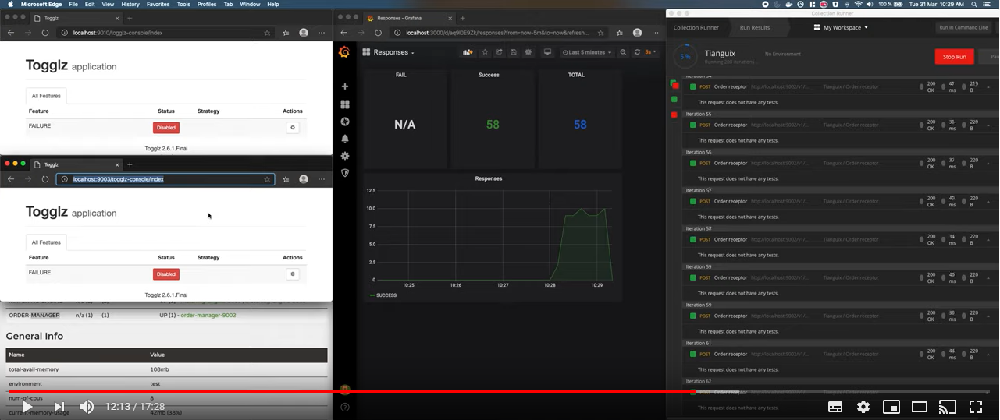

# Arquitectura de Software, Reto 2 (Disponibilidad)

Este repositorio contiene el código fuente del experimento realizado con el fin de comprobar 
el punto crítico asociado a la arquitectura de software que se diseñó para el **Reto 2**, reto asociado
a la disponibilidad de **Tianguix**.

## ASR a satisfacer

A continuación se detalla el ASR que se pretende satisfacer con la arquitectura que se diseñó, con motivo
de dar contexto sobre las motivaciones que nos llevaron a tomar las decisiones de diseño.



## Descripción del experimento

El estilo de arquitectura predominante que dirigió nuestro diseño es de tipo **Microservicios**,
para poder satisfacer el ASR descrito anteriormente, decidimos aplicar las tacticas de **Voting, Health check, descubrimiento de servicos y replicación** en nuestro **Motor de Emparejamiento**. Nuestro experimento pretende disipar las dudas y reducir la incertidumbre asociada a la detección de fallas en un sistema de voting, y de esa manera determinar 
si las decisiones tomadas nos ayudarán a favorecer la disponibilidad asociada al ASR seleccionado.

## Componente a probar

Como se mencionó en el apartado inmediatamente anterior, el experimento gira en torno al **Motor de Emparejamiento**,
cuya composición interna se detalla en el siguiente diagrama de componentes:


## Diseño del experimento

El experimento esta formado por tres microservicios **order-manager, matching-engine (dos instancias), conciliator** que se registran en el servicio
**registry**, el cual tiene la responsabilidad de hacer el Health Check y brindar la información para el descubrimiento de los servicios que se suscriben a el. 

Una vez todos los serivicios se encuentren disponibles se envia una orden por medio del **order-manager** el cual se la comunica a todas las instancias disponibles de **matching-engine**, de tal forma que se este ejecuta el proceso de emparejamiento con 10 hilos para comunicarle al **conciliator** el resultado del emparejamiento. El conciliator al tener las respuestas de todas las instancias de **matching-engine** determina si hay un consenso en las respuestas o si se presento alguna falla, por ultimo registra la determinación tomada en la base de datos InfluxDB y notificando a un canal de Slack si es el caso de una falla. 

Para porder evidenciar el registro de las fallas se utiliza Grafana, que nos permite graficar los datos registrados en series de tiempo.


## Resultados Esperados

- Detectar el **100%** de la fallas presentadas.

## Evidencia del experimento realizado

La evidencia de la ejecución del experimento se puede ver en el siguiente video:

[](https://youtu.be/ByDKDekzD4U)

## Tecnologías y frameworks utilizados

- Java 13 como lenguaje de programación
- [InfluxDB](https://grafana.com/) para la implementación del modelo de actores
- [Grafana](https://www.influxdata.com/) para la ejecución de las pruebas de carga
- [Spring Cloud Netflix] (https://spring.io/projects/spring-cloud-netflix) para la creación del registry, clientes rest, y descubriminetos de servicios.
- [Docker](https://www.docker.com/) para ejecutar los servicios de [InfluxDB](https://grafana.com/) y Grafana](https://www.influxdata.com/)

## Ejecución del experimento

Ne primera medida se debe levantar el servicio de [InfluxDB](https://grafana.com/) y [Grafana](https://www.influxdata.com/), para esto debe tener instalado [Docker](https://www.docker.com/products/docker-desktop) y [Docker Compose](https://docs.docker.com/compose/) en la maquina. Una vez se cuente con esto puede ejecutar el siguiente comando para iniciar los servicios:


 ``` console
 foo@bar:~$ cd [PROJECT_FOLDER]/docker 
```

 ``` console
 foo@bar:~$ docker-compose up -d 
```

Donde `PROJECT_FOLDER`es la carpeta raiz de este proyecto.

Para ingresar a la interfaz gráfica se debe seguir el siguiente link: http://localhost:3000/, e ingresar con las credenciales (username/password) **admin/admin** 
